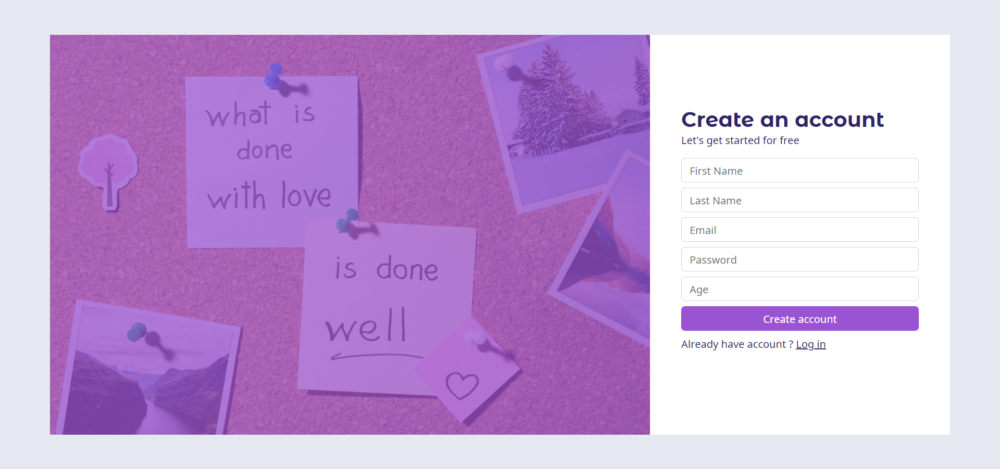
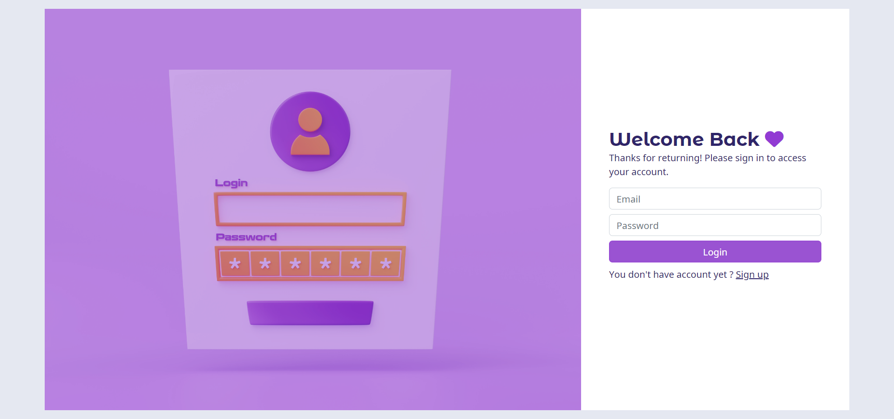
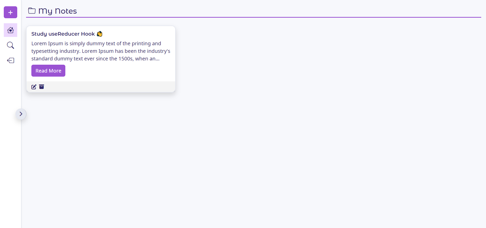
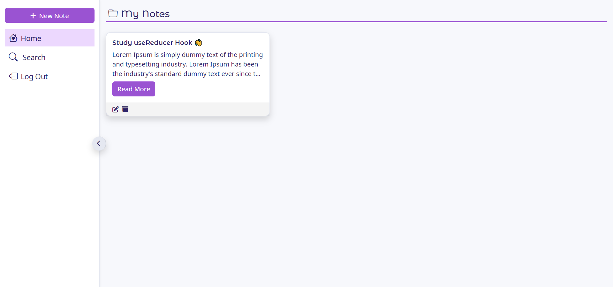
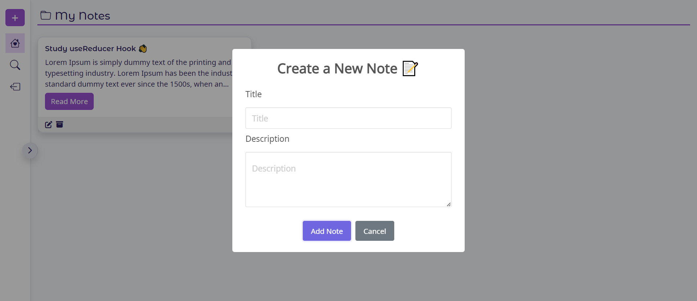
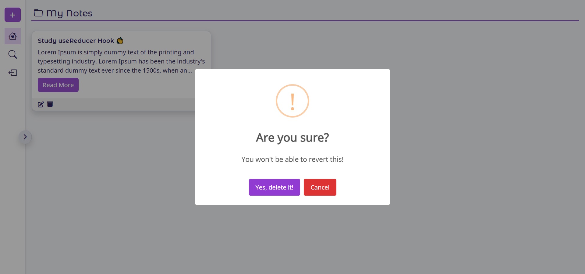
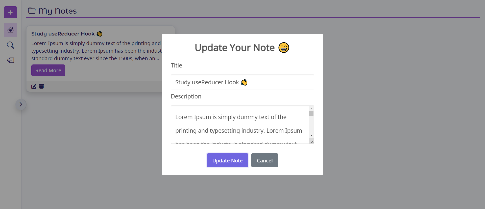

## Note App

[](https://choosealicense.com/licenses/mit/)

## Features

- User authentication with sign up and login functionality
- Note-taking capability with ability to add, update, and delete notes
- Read more/less button to allow users to expand/collapse note content
- Sidebar with ability to minimize and maximize for improved user experience
  - responsive sidebar

## Demo

Live Demo: https://usamaalidev.github.io/Note-App/

## Run Locally

Clone the project

```bash
  git clone https://link-to-project
```

Go to the project directory

```bash
  cd my-project
```

Install dependencies

```bash
  npm install
```

Start the server

```bash
  npm run start
```

## Screenshots

### Registeration Page



### Login Page



### Home Page with sidebar collapsed



### Home Page with sidebar opened



### Create a New Note modal



### Delete Note Alert



### Update Note modal



## Feedback

If you have any feedback, please reach out to us at usama.route@gmail.com

## Links

[](https://www.linkedin.com/in/usamaali-dev/)
